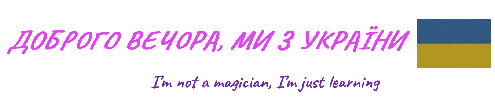

 

I'm a passionate FrontEnd student developer from Ukraine.

**what, why and how**

💼 -This repository was created for my hands-on projects Full Stack Web Developer Course in GoIT and contains my solutions from some challenges on Frontend Mentor.

📈 -Keeping weekly diary of my study. Starting April 18 2022.

<table width ="100%"><thead><tr>
<th valign="top" width="7%">Week</th>
<th valign="top" width="7%">Time coding</th>
<th valign="top" width="36%">Projects</th>
<th valign="top" width="36%">what I learned</th>
<th valign="top" width="14%">KPI</th></tr></thead>

<tr><td>2</td><td></td><td>
goit-markup-hw-01; goit-markup-hw-02
</td><td>css color and text
</td><td>⭐⭐⭐⭐⭐</td></tr>
<tr><td>1</td><td>6</td><td>
goit-markup-hw-01
</td><td>
html markup
</td><td>⭐⭐⭐</td></tr>
</table>
