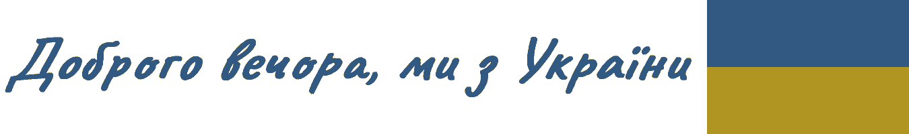

 

I'm a passionate FrontEnd student developer from Ukraine.

**what, why and how**

💼 -This repository was created for my hands-on projects Full Stack Web Developer Course in GoIT and contains my solution from some challenges on Frontend Mentor.

📈 -Keeping weekly diary of my study.

<table><thead><tr>
<th valign="top" width="10%">week</th>
<th valign="top" width="10%">Time coding</th>
<th valign="top" width="60%">Projects</th>
<th valign="top" width="20%">KPI</th></tr></thead>
<tr><td>1</td><td>12</td><td>
40dsdghffdgsdfgsfdgfdgsdfgsfdgfdsgsdfgsdgdfgdf
</td><td>⭐⭐⭐⭐⭐</td></tr>
</table>

<!--
**dima-kyiv/dima-kyiv** is a ✨ _special_ ✨ repository because its `README.md` (this file) appears on your GitHub profile.

Here are some ideas to get you started:

- 🔭 I’m currently working on ...
- 🌱 I’m currently learning ...
- 👯 I’m looking to collaborate on ...
- 🤔 I’m looking for help with ...
- 💬 Ask me about ...
- 📫 How to reach me: ...
- 😄 Pronouns: ...
- ⚡ Fun fact: ...
  -->

:
